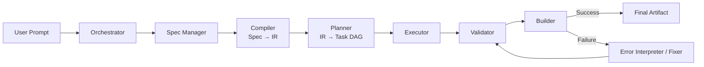

**Spec → IR → Execution** philosophy
USE AGENT IN EVERY STEPS, NOT CODE IMPLEMENTATION

---

## High-Level Pipeline

```text
User Prompt
→ Orchestrator
→ Spec Manager
→ Compiler (Spec → IR)
→ Planner (IR → Task DAG)
→ Executor
→ Validator
→ Builder
→ Error Interpreter / Fixer (loop)
→ Final Mod Artifact
```

---

## Core Design Principle

> **Human intent must never directly drive code generation.**  
> All generation flows through a **fully specified Intermediate Representation (IR)**.

This mirrors real compilers:

- **Spec** = design intent
    
- **IR** = concrete blueprint
    
- **Execution** = mechanical generation
    

---

## Component Breakdown

---

## 0. User Prompt

### Purpose

Capture high-level human intent in natural language.

### Input

- Natural-language prompt
    
- Optional context (previous conversation, preferences)
    

### Output

- `raw_request` (structured extraction of goals, constraints, hints)
    

---

## 1. Orchestrator (Conversation Controller)

### Purpose

Translate conversation into **minimal, explicit changes** to the mod specification.

### Responsibilities

- Ask clarifying questions if required
    
- Resolve ambiguities using safe defaults
    
- Produce **spec deltas**, not full rewrites
    

### Input

- `raw_request`
    
- Current `mod_spec.json`
    
- Agent knowledge (templates, compatibility rules)
    

### Output

- `spec_delta.json`
    
- Optional `clarifying_questions[]`
    
- Optional `decision_log.md`
    

---

## 2. Spec Manager

### Purpose

Maintain the **canonical source of user intent**.

### Responsibilities

- Apply deltas deterministically
    
- Track versions and diffs
    
- Preserve user intent exactly
    

### Input

- Previous `mod_spec.json`
    
- `spec_delta.json`
    

### Output

- Updated `mod_spec.json`
    
- `spec_version`
    
- Optional `spec_diff`
    

---

## 3. Compiler (Spec → IR)

### Purpose

Convert human intent into a **complete, validated, machine-readable blueprint**.

### Responsibilities

- Fill in defaults
    
- Resolve ambiguity
    
- Enforce Minecraft/loader/version constraints
    
- Normalize all fields
    
- Fail loudly on invalid specs
    

### Input

- `mod_spec.json`
    
- Compatibility matrix (MC version, loader, mappings)
    
- Default policies
    

### Output

- `mod_ir.json` (Intermediate Representation)
    
- `validation_report.json`
    
- `asset_manifest.json`
    

### Key Rule

> If any generator must “interpret English,” the IR is incomplete.

---

## What Is IR?

**IR (Intermediate Representation)** is a fully specified description of the mod to be generated.

**Properties:**

- Complete (no missing fields)
    
- Deterministic (same IR → same output)
    
- Schema-validated
    
- Tool-agnostic
    
- Machine-readable
    

IR defines:

- Registry IDs
    
- Attributes
    
- Recipes
    
- Assets
    
- Behaviors
    
- Version-specific constraints
    

---

## 4. Planner (IR → Task DAG)

### Purpose

Convert the IR into an **executable plan with dependencies**.

### Responsibilities

- Decompose IR into generation tasks
    
- Build a dependency DAG
    
- Identify parallelizable steps
    
- Bind tasks to tools
    

### Input

- `mod_ir.json`
    
- `asset_manifest.json`
    
- `tool_registry.json`
    

### Output

- `task_dag.json`
    
- `execution_plan.json`
    
- `tool_calls.jsonl`
    

---

## 5. Executor

### Purpose

Execute generation tasks and update the workspace.

### Responsibilities

- Run tool calls
    
- Generate code, data, and assets
    
- Track changes deterministically
    

### Input

- `execution_plan.json`
    
- `tool_calls.jsonl`
    
- `workspace/`
    

### Output

- Updated `workspace/`
    
- `execution_log.jsonl`
    
- `artifact_index.json`
    

---

## 6. Validator (Pre-Build)

### Purpose

Catch errors **before** invoking Gradle.

### Responsibilities

- JSON/schema validation
    
- Asset existence checks
    
- Registry ID conflicts
    
- Path correctness
    
- Lang completeness
    

### Input

- `workspace/`
    
- `mod_ir.json`
    
- `asset_manifest.json`
    

### Output

- `lint_report.json`
    
- `workspace_health.json`
    
- `fix_suggestions[]`
    

---

## 7. Builder (Gradle)

### Purpose

Compile and package the mod.

### Input

- `workspace/`
    
- Build configuration
    

### Output

- `mod.jar`
    
- `build_log.txt`
    
- `build_status.json`
    

---

## 8. Error Interpreter / Fixer

### Purpose

Translate failures into **deterministic patches**, not retries.

### Responsibilities

- Parse Gradle and validation errors
    
- Identify root causes
    
- Patch workspace or spec safely
    
- Loop back into validation/build
    

### Input

- `build_status.json`
    
- `build_log.txt`
    
- `lint_report.json`
    
- `artifact_index.json`
    

### Output

- `patch_plan.json`
    
- Patched `workspace/`
    
- Optional `spec_delta.json`
    

---

## 9. Final Artifact

### Purpose

Deliver the completed mod with provenance.

### Output

- `final/mod.jar`
    
- `release_notes.md`
    
- `provenance/`
    
    - `mod_spec.json`
        
    - `mod_ir.json`
        
    - logs and hashes
        

---

## Execution Graph (Mermaid)



---

## Key Architectural Rules

1. **Spec is for humans. IR is for machines.**
    
2. **No code generation without IR.**
    
3. **Generators must be dumb and deterministic.**
    
4. **All reasoning happens before execution.**
    
5. **Errors trigger patches, not retries.**
    

---

## Final Takeaway

This system is **not a chatbot that writes mods**.  
It is a **compiler-driven agent system** that _happens_ to use LLMs.

That distinction is what makes it scalable, debuggable, and production-ready.