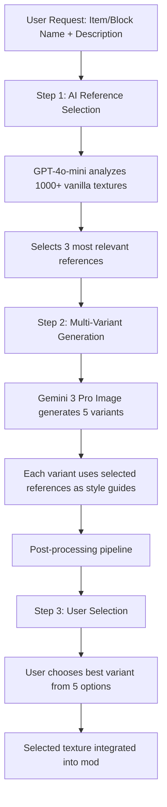

# Texture Generation Workflow

## Overview

The texture generation system uses a sophisticated AI-powered pipeline to create high-quality, Minecraft-style pixel art textures. The workflow combines intelligent reference selection with multi-variant generation to give users the best possible textures.

---

## Complete Workflow Pipeline



---

## Step 1: AI-Powered Reference Selection

### Purpose
Intelligently select the most relevant vanilla Minecraft textures to use as visual style guides for generation.

### Process

**Agent:** `ReferenceSelector` (GPT-4o-mini via LangChain)

**Input:**
- Item/block name (e.g., "Ruby Gem")
- Item/block description (e.g., "A precious red gemstone used for crafting")
- Type (item or block)

**Analysis Criteria:**
1. **Visual Similarity** - Similar shapes and structures (e.g., gems → diamond, emerald)
2. **Material Type** - Same material family (e.g., metal → iron, gold; crystal → diamond)
3. **Color Palette** - Similar color schemes (e.g., red items → ruby references)
4. **Complexity Level** - Matching detail level (simple items → simple references)
5. **Style Consistency** - Minecraft's signature pixel art aesthetic

**Output:**
- 3 most relevant reference texture paths
- Reasoning for each selection
- Fallback to no references if no good matches exist

**Example:**
```
Input: "Ruby Sword - A powerful sword made from red rubies"

AI Analysis:
→ Selected References:
  1. diamond_sword.png (same weapon type, similar structure)
  2. ruby.png (same material/color)
  3. netherite_sword.png (alternative blade style)

Reasoning: "Diamond sword provides the standard sword structure,
ruby reference ensures correct material coloring, netherite sword
offers style variation for a premium weapon."
```

---

## Step 2: Multi-Variant Generation with Gemini 3 Pro

### Purpose
Generate 5 distinct texture variants using AI image generation, guided by reference textures.

### Process

**Model:** `gemini-3-pro-image-preview`

**For Each Variant (1-5):**

1. **Prompt Construction**
   - Enhanced pixel art prompt with Minecraft-specific guidance
   - Rarity-based style modifiers (COMMON, UNCOMMON, RARE, EPIC)
   - Detailed color palette specifications
   - Technical requirements (16x16, pure pixels, no anti-aliasing)

2. **Reference Integration**
   - Selected reference textures passed to model as visual style guides
   - Model uses references for: style consistency, color palette, pixel art aesthetic
   - References guide but don't copy (ensures originality)

3. **Generation**
   - Gemini 3 Pro generates high-resolution texture
   - Model follows prompt constraints + reference styling
   - Each variant has natural variation while maintaining style

### Configuration

**From `config.py`:**
```python
IMAGE_MODEL = "gemini-3-pro-image-preview"
IMAGE_VARIANT_COUNT = 5  # Number of variants to generate
IMAGE_SIZE = "1024x1024"  # Generated at high-res, downsampled later
IMAGE_QUALITY = "standard"
```

### Generation Output

**Per Variant:**
- 1 high-resolution (1024x1024) texture from Gemini
- Passes to post-processing pipeline

**Total Output:**
- 5 distinct texture variants ready for user selection

---

## Step 3: Post-Processing Pipeline

Each generated texture undergoes sophisticated processing to achieve authentic Minecraft pixel art:

### 3.1 Background Removal (Items Only)
- **Edge-based flood fill** - Removes peripheral white background
- **White replacement** - Converts white background to transparency
- **Interior white preservation** - Keeps white pixels that are part of the sprite

### 3.2 Auto-Crop & Padding
- **Smart cropping** - Automatically crops to sprite bounds
- **Centered padding** - Adds consistent margins (20% minimum)
- **Optimal sizing** - Ensures sprite occupies 60-70% of canvas

### 3.3 Two-Stage Downsampling
- **Stage 1:** High-res → 32x32 (LANCZOS resampling for quality)
- **Stage 2:** 32x32 → 16x16 (NEAREST for crisp pixels)
- **Result:** Sharp pixel art without blur or anti-aliasing

### 3.4 Minecraft Palette Quantization
- **Color matching** - Maps colors to Minecraft-style palette (40+ colors)
- **Nearest neighbor** - Finds closest palette color for each pixel
- **Consistency** - Ensures vanilla Minecraft aesthetic

### 3.5 Enhanced Edge Cleanup
- **Stray pixel removal** - Eliminates single isolated pixels
- **Edge enhancement** - Strengthens outlines and boundaries
- **Final polish** - Professional-quality output

---

## Step 4: User Selection Interface

### Presentation
- User receives **5 texture variants** side-by-side
- Each variant numbered (1-5) for easy selection
- Preview at 16x16 (actual size) and enlarged for detail inspection

### Selection
- User chooses their preferred variant
- Selected texture becomes the official mod texture
- Non-selected variants discarded

### Benefits of Multi-Variant System
- **Quality assurance** - Multiple options increase chance of perfect texture
- **Style diversity** - Each variant offers subtle differences
- **User control** - Final creative decision stays with user
- **Higher success rate** - 5 chances to get it right vs. 1

---

## Technical Implementation

### Code Structure

**Main Entry Point:**
```python
from agents.tools import ImageGenerator

generator = ImageGenerator()

# Generate 5 item texture variants
variants = generator.generate_item_texture(
    item_description="A precious red gemstone",
    item_name="Ruby Gem",
    count=5  # Optional, defaults to IMAGE_VARIANT_COUNT
)

# variants is a List[bytes] with 5 PNG images
```

**For Blocks:**
```python
# Generate 5 block texture variants
variants = generator.generate_block_texture_from_spec(
    block_spec={
        "blockName": "Ruby Ore",
        "description": "Ore containing ruby gems",
        "properties": {"material": "STONE", "luminance": 0}
    },
    count=5
)
```

**For Tools:**
```python
# Generate 5 tool texture variants
variants = generator.generate_tool_texture(
    tool_spec={
        "toolName": "Ruby Pickaxe",
        "description": "A pickaxe made from rubies"
    },
    count=5
)
```

### Internal Flow

```python
# Simplified internal implementation
def generate_item_texture(item_description, item_name, count=5):
    # Step 1: AI selects references (once)
    references = reference_selector.select_references(
        item_description, item_name, max_refs=3
    )

    # Step 2: Generate each variant
    variants = []
    for i in range(count):
        # Build prompt
        prompt = create_pixel_art_prompt(item_description, item_name)

        # Generate with Gemini 3 Pro + references
        image = gemini_client.generate_content(
            model="gemini-3-pro-image-preview",
            contents=[prompt] + references
        )

        # Post-process
        processed = post_process_pipeline(image)
        variants.append(processed)

    return variants  # List of 5 PNG images
```

---

## Quality Assurance

### Reference Selection Validation
- LLM reasoning logged for each selection
- Fallback to no references if quality threshold not met
- Manual override capability for specific use cases

### Generation Quality Controls
- **Prompt engineering** - Extensive negative prompts prevent common issues
- **Style enforcement** - Reference textures ensure Minecraft aesthetic
- **Multi-variant safety** - 5 attempts minimize chance of failure

### Post-Processing Validation
- **Transparency check** - Ensures clean backgrounds
- **Size verification** - Confirms exact 16x16 output
- **Palette compliance** - Validates Minecraft color usage

---

## Performance Characteristics

### API Calls Per Item

| Step | API | Calls |
|------|-----|-------|
| Reference Selection | OpenAI GPT-4o-mini | 1 |
| Texture Generation | Gemini 3 Pro Image | 5 |
| **Total** | | **6 API calls** |

### Timing (Approximate)

- Reference selection: ~2-3 seconds
- Per variant generation: ~3-5 seconds
- Post-processing per variant: ~0.5 seconds
- **Total time:** ~20-30 seconds for 5 variants

### Cost Optimization

- **Reference selection once** - Reused across all 5 variants
- **Batch generation** - 5 variants in single workflow
- **Smart caching** - Reference textures cached locally

---

## Configuration

All settings can be customized in `backend/config.py`:

```python
# Image Generation - Using Gemini 3 Pro Image Preview
IMAGE_MODEL = "gemini-3-pro-image-preview"
IMAGE_SIZE = "1024x1024"
IMAGE_QUALITY = "standard"
IMAGE_VARIANT_COUNT = 5  # Adjust number of variants

# Reference Selection - Using OpenAI GPT-4o-mini
# (configured via OPENAI_API_KEY)
```

---

## Future Enhancements

### Planned Improvements
1. **Variant quality scoring** - Auto-rank variants by quality metrics
2. **Style transfer learning** - Fine-tune on user preferences
3. **Batch optimization** - Parallel variant generation
4. **User feedback loop** - Learn from selections over time
5. **A/B testing** - Compare different prompt strategies

### Potential Features
- Custom reference upload (user-provided textures)
- Style mixing (combine multiple references)
- Animation support (multi-frame textures)
- Texture variations (damaged, worn, enchanted versions)

---

## Troubleshooting

### Common Issues

**Problem:** All 5 variants look too similar
- **Cause:** Prompt too restrictive or references too homogeneous
- **Solution:** Adjust temperature, vary references, reduce constraints

**Problem:** Variants don't match Minecraft style
- **Cause:** References not selected properly or prompt issues
- **Solution:** Review reference selection reasoning, update prompt templates

**Problem:** Generation takes too long
- **Cause:** API latency or rate limiting
- **Solution:** Reduce variant count temporarily, implement retry logic

**Problem:** User can't decide between variants
- **Cause:** All variants high quality (good problem!)
- **Solution:** Implement tie-breaker voting or quality metrics

---

## Summary

The texture generation workflow combines:
1. **🤖 AI-powered reference selection** - Smart texture matching
2. **🎨 Multi-variant generation** - 5 options for quality assurance
3. **✨ Professional post-processing** - Authentic Minecraft pixel art
4. **👤 User selection** - Final creative control

**Result:** High-quality, style-consistent Minecraft textures with minimal user effort.
